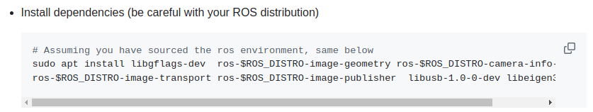
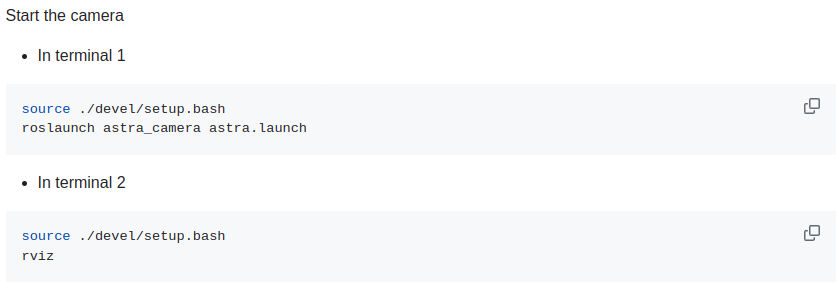
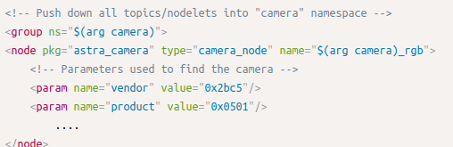
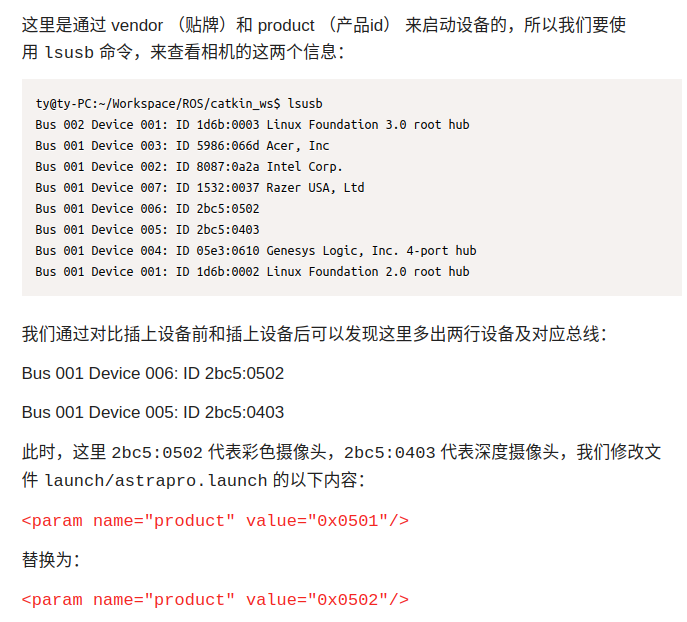
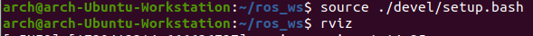
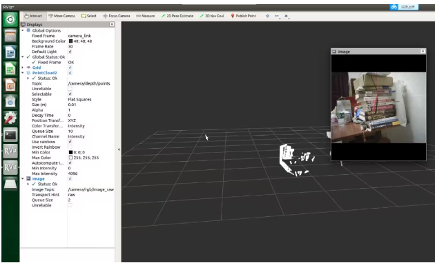
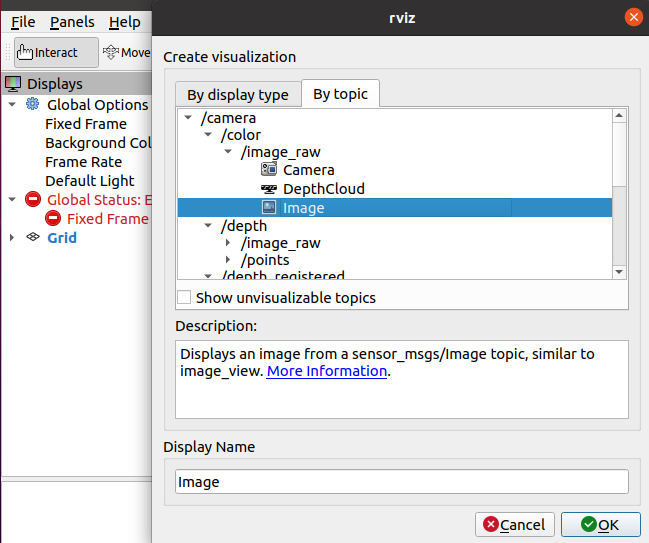
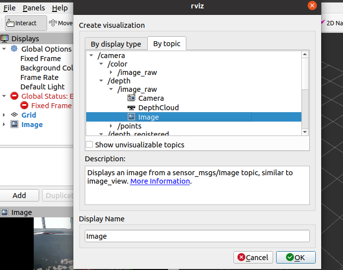
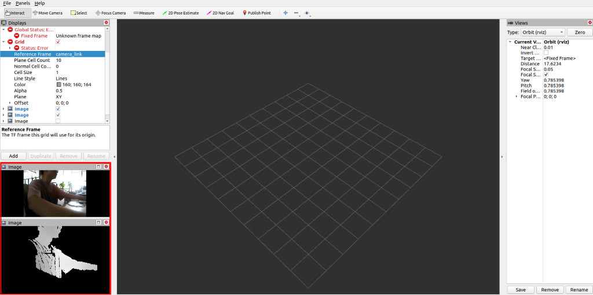

# astra 相机配置

1.官方链接文档

[https://github.com/orbbec/ros_astra_camera](https://github.com/orbbec/ros_astra_camera)



依赖安装出错：


不影响配置文件的安装

其余的正常按教程来

到这里先停止



2.点到这个网站

[https://www.bilibili.com/read/cv26440181/](https://www.bilibili.com/read/cv26440181/)

根据设备的 id，修改一下启动参数。我们打开 launch 文件 launch/astrapro.launch 其中有一部分配置如下：





3.开始启动摄像头

在 ros_ws 这个文件夹目录下面输入指令




4.相机调试

打开 rviz 如图



（1）在 fixed_frame 选项中，选择 camera_link；

（2）添加 image 选项，分别选择话题:

```
  /camera/rgb/image_raw代表rgb图像，

  /camera/depth/image_raw代表深度图像，

  /camera/ir/image代表红外图像；
```

（3）添加 PointCloud2 选项，选择话题/camera/depth/points





彩色和深度图像(左下角)出来



5.具体参数

**查看 topics / services/ parameters **

**rostopic list**

**rosservice  list**

**rosparam list**

**其中：**

**rostopic list**
**/camera/color/camera_info**
**/camera/color/image_raw**
**/camera/depth/camera_info**
**/camera/depth/image_raw**
**/camera/depth/points**
**/camera/depth_registered/points**
**/camera/extrinsic/depth_to_color**
**/camera/ir/camera_info**
**/camera/ir/image_raw**
**/camera/reset_device**
**/clicked_point**
**/initialpose**
**/move_base_simple/goal**
**/rosout**
**/rosout_agg**
**/tf**
**/tf_static**
**通过这 2 个 topic ：**
**/camera/color/image_raw**
**/camera/depth/image_raw**
**我们就可以随意给其他节点传彩图和深度图像了。**
6. 

在ros_ws/src/ros_astra_camera 文件夹下输入： 

rviz -d rviz/astra_camera.rviz 

直接显示出彩色图像，深度图像，点云 


 

6.1在ros_ws/src/ros_astra_camera 文件夹下创建astra_camera.rviz 输入： 

touch astra_camera.rviz  

6.2 增加文件的读写权限输入： 

chmod +x astra_camera.rviz 

6.3将下面的代码复制到astra_camera.rviz中并保存 

Panels: 

  - Class: rviz/Displays 

    Help Height: 0 

    Name: Displays 

    Property Tree Widget: 

      Expanded: 

        - /Global Options1 

        - /Status1 

        - /PointCloud21 

        - /Depth1 

        - /RGB1 

      Splitter Ratio: 0.5 

    Tree Height: 361 

  - Class: rviz/Selection 

    Name: Selection 

  - Class: rviz/Tool Properties 

    Expanded: 

      - /2D Pose Estimate1 

      - /2D Nav Goal1 

      - /Publish Point1 

    Name: Tool Properties 

    Splitter Ratio: 0.5886790156364441 

  - Class: rviz/Views 

    Expanded: 

      - /Current View1 

    Name: Views 

    Splitter Ratio: 0.5 

  - Class: rviz/Time 

    Experimental: false 

    Name: Time 

    SyncMode: 0 

    SyncSource: PointCloud2 

Preferences: 

  PromptSaveOnExit: true 

Toolbars: 

  toolButtonStyle: 2 

Visualization Manager: 

  Class: "" 

  Displays: 

    - Alpha: 0.5 

      Cell Size: 1 

      Class: rviz/Grid 

      Color: 159; 147; 147 

      Enabled: true 

      Line Style: 

        Line Width: 0.029999999329447746 

        Value: Lines 

      Name: Grid 

      Normal Cell Count: 0 

      Offset: 

        X: 0 

        Y: 0 

        Z: 0 

      Plane: XZ 

      Plane Cell Count: 10 

      Reference Frame: camera_depth_optical_frame 

      Value: true 

    - Alpha: 1 

      Autocompute Intensity Bounds: true 

      Autocompute Value Bounds: 

        Max Value: 9.859000205993652 

        Min Value: 0.5799999833106995 

        Value: true 

      Axis: X 

      Channel Name: intensity 

      Class: rviz/PointCloud2 

      Color: 255; 255; 255 

      Color Transformer: RGB8 

      Decay Time: 0 

      Enabled: true 

      Invert Rainbow: false 

      Max Color: 255; 255; 255 

      Max Intensity: 4096 

      Min Color: 0; 0; 0 

      Min Intensity: 0 

      Name: PointCloud2 

      Position Transformer: XYZ 

      Queue Size: 10 

      Selectable: true 

      Size (Pixels): 3 

      Size (m): 0.009999999776482582 

      Style: Squares 

      Topic: /camera/depth/points 

      Unreliable: false 

      Use Fixed Frame: true 

      Use rainbow: true 

      Value: true 

    - Class: rviz/Image 

      Enabled: true 

      Image Topic: /camera/depth/image_raw 

      Max Value: 1 

      Median window: 5 

      Min Value: 0 

      Name: Depth 

      Normalize Range: true 

      Queue Size: 2 

      Transport Hint: raw 

      Unreliable: false 

      Value: true 

    - Class: rviz/Image 

      Enabled: true 

      Image Topic: /camera/color/image_raw 

      Max Value: 1 

      Median window: 5 

      Min Value: 0 

      Name: RGB 

      Normalize Range: true 

      Queue Size: 2 

      Transport Hint: raw 

      Unreliable: false 

      Value: true 

  Enabled: true 

  Global Options: 

    Background Color: 48; 48; 48 

    Default Light: true 

    Fixed Frame: camera_depth_optical_frame 

    Frame Rate: 30 

  Name: root 

  Tools: 

    - Class: rviz/Interact 

      Hide Inactive Objects: true 

    - Class: rviz/MoveCamera 

    - Class: rviz/Select 

    - Class: rviz/FocusCamera 

    - Class: rviz/Measure 

    - Class: rviz/SetInitialPose 

      Theta std deviation: 0.2617993950843811 

      Topic: /initialpose 

      X std deviation: 0.5 

      Y std deviation: 0.5 

    - Class: rviz/SetGoal 

      Topic: /move_base_simple/goal 

    - Class: rviz/PublishPoint 

      Single click: true 

      Topic: /clicked_point 

  Value: true 

  Views: 

    Current: 

      Class: rviz/Orbit 

      Distance: 3.863161325454712 

      Enable Stereo Rendering: 

        Stereo Eye Separation: 0.05999999865889549 

        Stereo Focal Distance: 1 

        Swap Stereo Eyes: false 

        Value: false 

      Focal Point: 

        X: 2.0370023250579834 

        Y: -1.0987344980239868 

        Z: -0.031386714428663254 

      Focal Shape Fixed Size: true 

      Focal Shape Size: 0.05000000074505806 

      Invert Z Axis: false 

      Name: Current View 

      Near Clip Distance: 0.009999999776482582 

      Pitch: 0.004796733148396015 

      Target Frame: <Fixed Frame> 

      Value: Orbit (rviz) 

      Yaw: 2.4886555671691895 

    Saved: ~ 

Window Geometry: 

  Depth: 

    collapsed: false 

  Displays: 

    collapsed: false 

  Height: 961 

  Hide Left Dock: false 

  Hide Right Dock: false 

  QMainWindow State: 000000ff00000000fd0000000400000000000001fa00000323fc020000000afb0000001200530065006c0065006300740069006f006e00000001e10000009b0000005c00fffffffb0000001e0054006f006f006c002000500072006f0070006500720074006900650073020000019b000001b500000185000000a3fb000000120056006900650077007300200054006f006f02000001df000002110000018500000122fb000000200054006f006f006c002000500072006f0070006500720074006900650073003203000002880000011d000002210000017afb000000100044006900730070006c006100790073010000003d000001a6000000c900fffffffb0000000a0044006500700074006801000001e9000000ae0000001600fffffffb00000006005200470042010000029d000000c30000001600fffffffb0000002000730065006c0065006300740069006f006e00200062007500660066006500720200000138000000aa0000023a00000294fb00000014005700690064006500530074006500720065006f02000000e6000000d2000003ee0000030bfb0000000c004b0069006e0065006300740200000186000001060000030c00000261000000010000019200000323fc0200000005fb0000001e0054006f006f006c002000500072006f00700065007200740069006500730100000041000000780000000000000000fb0000000a00560069006500770073010000003d00000211000000a400fffffffb000000040069007201000002540000010c0000001600fffffffb0000000a0049006d00610067006501000002fb000000c00000000000000000fb0000001200530065006c0065006300740069006f006e010000025a000000b200000000000000000000000200000490000000a9fc0100000001fb0000000a00560069006500770073030000004e00000080000002e10000019700000003000007800000003efc0100000002fb0000000800540069006d0065010000000000000780000002eb00fffffffb0000000800540069006d00650100000000000004500000000000000000000003e80000032300000004000000040000000800000008fc0000000100000002000000010000000a0054006f006f006c00730100000000ffffffff0000000000000000 

  RGB: 

    collapsed: false 

  Selection: 

    collapsed: false 

  Time: 

    collapsed: false 

  Tool Properties: 

    collapsed: false 

  Views: 

    collapsed: false 

  Width: 1920 

  X: 0 

  Y: 27 
