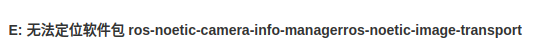

# astra 相机配置

1.官方链接文档

[https://github.com/orbbec/ros_astra_camera](https://github.com/orbbec/ros_astra_camera)


依赖安装出错：



不影响配置文件的安装

其余的正常按教程来

到这里先停止


2.点到这个网站

[https://www.bilibili.com/read/cv26440181/](https://www.bilibili.com/read/cv26440181/)

根据设备的 id，修改一下启动参数。我们打开 launch 文件 launch/astrapro.launch 其中有一部分配置如下：


3.开始启动摄像头

在 ros_ws 这个文件夹目录下面输入指令


4.相机调试

打开 rviz 如图


（1）在 fixed_frame 选项中，选择 camera_link；

（2）添加 image 选项，分别选择话题:

```
  /camera/rgb/image_raw代表rgb图像，

  /camera/depth/image_raw代表深度图像，

  /camera/ir/image代表红外图像；
```

（3）添加 PointCloud2 选项，选择话题/camera/depth/points


彩色和深度图像(左下角)出来


5.具体参数

**查看 topics / services/ parameters **

**rostopic list**

**rosservice  list**

**rosparam list**

**其中：**

**rostopic list**
**/camera/color/camera_info**
**/camera/color/image_raw**
**/camera/depth/camera_info**
**/camera/depth/image_raw**
**/camera/depth/points**
**/camera/depth_registered/points**
**/camera/extrinsic/depth_to_color**
**/camera/ir/camera_info**
**/camera/ir/image_raw**
**/camera/reset_device**
**/clicked_point**
**/initialpose**
**/move_base_simple/goal**
**/rosout**
**/rosout_agg**
**/tf**
**/tf_static**
**通过这 2 个 topic ：**
**/camera/color/image_raw**
**/camera/depth/image_raw**
**我们就可以随意给其他节点传彩图和深度图像了。**
